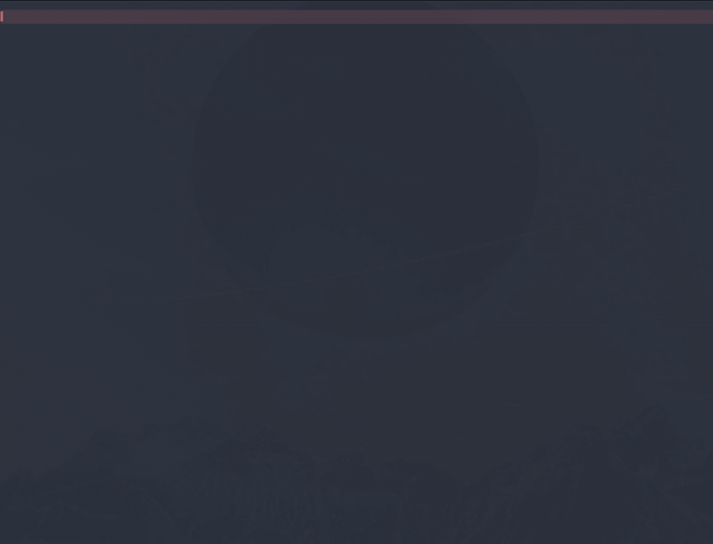

<!-- omit in toc -->
# Chess Study v2

> A chess study helper, PGN viewer/editor and opening trainer for [Obsidian](https://obsidian.md/).

**Chess Study v2** is a fork of [Obsidian Chess Study](https://community.obsidian.md/plugins/chess-study) by [@chrislicodes](https://github.com/chrislicodes). The original turns a PGN into a playable, annotatable board inside a note, with comments and arrows stored in your vault. This fork keeps all of that and adds the parts that turn a set of notes into something you can actually rehearse: an importer that brings a chess.com or Lichess game in whole, variations of any depth, chess.com-style move classifications, a rebuilt widget, and a **trainer** that plays your study back at you and tells you where you went wrong.



<!-- omit in toc -->
## Table of contents

- [What v2 adds](#what-v2-adds)
	- [Trainer](#trainer)
	- [The map](#the-map)
	- [A board on its own](#a-board-on-its-own)
	- [Merging the studies in a note](#merging-the-studies-in-a-note)
	- [PGN import that keeps your annotations](#pgn-import-that-keeps-your-annotations)
	- [Variations at any depth](#variations-at-any-depth)
	- [Move classifications](#move-classifications)
	- [A rebuilt widget](#a-rebuilt-widget)
	- [Annotations you can see from the move list](#annotations-you-can-see-from-the-move-list)
	- [Autosave](#autosave)
- [Inherited from the original](#inherited-from-the-original)
- [Installation](#installation)
- [Usage](#usage)
- [Settings](#settings)
- [Keyboard shortcuts](#keyboard-shortcuts)
- [Known limitations](#known-limitations)
- [Development](#development)
- [Roadmap](#roadmap)
- [Credits](#credits)
- [Alternatives](#alternatives)
- [License](#license)

## What v2 adds

### Trainer

The graduation-cap button in the control strip starts a drill. It asks which colour you want to play - offering the study's own, if it has one - flips the board to it, and rewinds to the study's first position: the standard array for an ordinary game, or whatever FEN the study opens from.

From there you play your colour and the study plays the other. A move the study does not know is refused: the board snaps back, the attempted move is drawn as a red arrow, and it goes on the tally.

The two sides are asked different questions, because a repertoire is not symmetric. **Your** move is the one you wrote down, so only the continuation of the line is accepted; a variation at your own turn is an alternative you considered and passed over, not another answer. **Their** move is theirs to choose, so every reply the study records is a line you undertook to know, and the drill picks among them rather than always taking the mainline. Within a session a position always gets the same reply, so stepping back through the line reviews what you played; the next session draws afresh.

Which reply comes up is not uniform. Lines you have never drilled go first, since a repertoire is only prepared once every branch has been seen at least once. After that it is a weighted draw favouring the lines you get wrong, with a floor under the rest so a line you know cold still comes round. A move found only after a hint counts as one you did not know.

A branch you would rather keep than rehearse - a sideline you have written up but not learnt, an opponent's reply you have decided to meet over the board - can be taken out of drills without deleting it. **Exclude from drills** is on any move's right-click menu, and it takes the rest of that line and every variation hanging off it: those are only reachable by playing the move you excluded. The move list dims the whole span and rings the move the flag sits on, so it is clear both where drilling stops and how far that reaches. Nothing else changes: the moves stay in the study, in the move list, and on the board.

That history lives in `<id>.drill.json` beside the study rather than inside it, so drilling never touches the study file, the record can be deleted on its own to start over, and a study you share carries no one's progress. Losing it costs you the weighting and nothing else.


Hints escalate, one per press, and a stage with nothing to offer is skipped so the first press always reveals something:

1. **What your study already says**: the note on the move being asked for, falling back to the note on the move just played.
2. **The piece to move**, marked on the board.
3. **An arrow** to where it goes.

Hints are drawn as board decorations that are never saved, and they reset as soon as the position moves on. The move list empties for the length of a session, the notes panel gives way to the trainer's own strip, and the arrows saved on a move stay hidden until you ask for them, since any of the three would hand over the answer.

When the line runs out - no continuation for you, or nothing left for the study to reply with - the drill ends and leaves a report: moves played, mistakes made, and a row per mistake giving the move number, what you played, and what the study wanted. The same wrong move in the same position counts once, with a multiplier.


Nothing a session does is written to your study. Its history is a separate file, and the study itself is untouched: correct moves navigate, refused ones put the board back so a drill can never leave stray variations behind, and anything drawn on the board while one is running is dropped when the position moves on.

That last part is not only tidiness. The board library reports the whole set of shapes on every change rather than a delta, so with a move's saved arrows hidden, a single stroke drawn mid-drill would stand in for all of them and the rest would be silently gone. Hiding the saved arrows and declining to record new ones are the same rule: a drill cannot edit the study.

### The map

The network button opens the study as a diagram. One card per run of moves with nothing to decide in it, and a fork wherever the line branches, so a repertoire reads as what it actually is: a trunk, and the points where your opponent gets to choose.

Each card carries a position, the moves around it, and a coloured edge saying how the line is holding up - drilled clean, shaky, never drilled, excluded, or **no reply recorded yet**. That last one is the useful one: a line that stops on your opponent's move is a hole in the repertoire, and on the map it is a stub sitting next to lines that run to move fifteen.

Which position depends on where the card sits. The trunk shows where it hands over - the one your opponent makes their first choice in - and every branch shows the move that opened it, since a branch card answers "what if they play this?" and that position is the answer. Where a line ends up is what the moves underneath are for.

A move that reaches a position some other line also reaches carries a small ⇄, and clicking it takes you to the card that line sits in - the view moves, the map stays open. The mark is quiet until you hover it: on a repertoire built out of move orders these turn up everywhere, and a diagram full of shouting arrows says less than one where they wait to be looked for. The lines are still drawn as a tree, so a transposition is two cards that point at each other rather than one card two lines run into.

Drag to pan, scroll to zoom, or use the fit button to frame the whole thing. Clicking any move sends the board to it and closes the map.

The last button exports the diagram as an Obsidian **canvas** file beside the note - a card per line, where the map put it, with its board, its moves and how it is holding up. That one is a snapshot: nothing reads it back, and it goes stale as soon as the study changes. That is what it is for. The map cannot be drawn on or rearranged, and a canvas can, so a repertoire you want to spread out and scribble over goes there. An existing file is never overwritten - the name is suffixed - so a canvas you have already annotated survives a second export.

The boards on those cards are `chessPosition` blocks, which means they are drawn by this plugin rather than baked into the file. In the vault you exported from that is no different from any other board; open the canvas somewhere without the plugin and the cards keep their notation and lose their diagrams.

### A board on its own

```chessPosition
fen: r1bqkb1r/pppp1ppp/2n2n2/4p3/2B1P3/5N2/PPPP1PPP/RNBQK2R w KQkq - 4 4
orientation: white
size: 240
```

A position with no study behind it: no moves, no notes, no stored file. `fen` is the only setting it needs - `orientation` and `size` are optional, and without a size it fills the width it is given. It is what the exported canvas uses for its diagrams, and it is useful on its own wherever a note wants to show a position rather than play through one.

Which side the map reads for is the study's own, shown as a chip beside the move list and switched by clicking it. A study that has never said assumes the side the board is turned to and draws the chip dashed to admit as much; starting a drill and choosing a colour settles it too, since that is the same question.

### Merging the studies in a note

A note tends to collect studies of the same opening - one from a game you lost, one from a video, one you sat down and wrote. **Merge every chess study in this note into one** takes them all and builds a single tree.

The first study is the trunk: its mainline stays the mainline, and every line the others add arrives as a variation off the move it branches from. A line both studies already have is descended into rather than duplicated, and annotations fill in rather than overwrite - the first study keeps its notes, and a later one can only supply what is missing.

The merged study is written as a new one and its block is inserted at the cursor. **The studies it was built from are left exactly as they are**: merging is not a decision to throw them away, and you delete them yourself once you are happy. What you have already drilled comes with it, since the merged tree keeps every move's identity.

Two things it will tell you about rather than guess at: a study that starts from a different position is left out, and an alternative to a study's *first* move has nowhere to hang - nothing precedes it - so it is dropped and counted.

### PGN import that keeps your annotations

An annotated game from chess.com or Lichess comes in whole rather than as a bare list of moves:

- **Comments** become notes on the move they follow, with lines the export wrapped joined back up.
- **Glyphs** become classifications (`$1` Great, `$2` Mistake, `$3` Brilliant, `$4` Blunder, `$6` Inaccuracy), and so do judgements written onto the move itself, so `e4!` and `e4 $1` mean the same thing.
- **Variations** become variations, nested, keeping their own comments and glyphs.
- A **`[FEN]` header** is honoured, so a game that starts from a position starts there.

The original could not read these games at all: a `[Link "https://..."]` header was enough to make it reject the paste as a malformed FEN. The library underneath it also drops variations, has no notion of glyphs, and files comments by position rather than by move. A move that will not play no longer takes the whole import down with it either: it is left out, and the notice says how many were.

### Variations at any depth

The original supported one level of variations. This fork makes the move tree recursive, so variations nest up to four levels deep, each with its own rail colour and indent.

Right-clicking any variation move opens a menu to **promote** it (one level, or straight to the mainline), **reorder** it among its siblings, or **delete** it, the last behind a confirmation naming how many moves will go, nested ones included.

**Delete move** is on the same menu for every move, mainline included. It removes that move and the rest of the line it sits in: inside a variation that means the rest of that branch and nothing else, so the line it hangs off carries on. Variations growing out of the removed moves go with them, and the count is named before anything happens.


Playing a move that an existing variation already starts with follows that variation rather than creating a second one saying the same thing, and stepping back off the front of a variation lands on the move it hangs off.

### Move classifications

Seven chess.com-style labels (Brilliant, Great, Excellent, Good, Inaccuracy, Mistake, Blunder) set by pressing `1`-`7` (`0` clears), from a picker in the notes panel, or from the right-click menu on any move. Each shows as a coloured badge beside the move in the list and on the destination square of the board.


### A rebuilt widget

- **Fills the note width** instead of a fixed 750px box, and stacks the board above the move list on narrow screens.
- **Resizable** by dragging the bottom-right corner. The width is written back into the code block, so a study keeps its size.
- **Four board themes** (Blue by default, Blue soft, Green, Brown), drawn from two colours each rather than a bitmap per theme, with square highlights that follow the theme.
- **Coordinates drawn inside the board**, chess.com style. The original positioned them outside it, where the widget clipped them.
- **Flip the board**, and **copy the current FEN** to the clipboard.
- A **notes panel** that is labelled, collapsible, and shows which move a note belongs to.


### Annotations you can see from the move list

Moves carrying a note get an accent dot, moves carrying arrows get a green dot, and hovering either shows the note or counts the arrows. Previously the only way to find your annotations was to step through every move.

### Autosave

Changes are saved automatically, debounced, and flushed when the note closes. The save button keeps working and gains a dot while there is something unsaved. In the original, nothing autosaved: annotating a run of moves and closing the note lost all of it silently.

## Inherited from the original

Everything the original does still works:

- Import a PGN, start from a FEN, or begin a fresh game
- Studies stored as JSON in your vault
- Legal moves only
- Navigate with buttons or by clicking a move
- Draw and persist arrows and circles
- Notes per move, with Markdown support
- Undo the last move

## Installation

Chess Study v2 is **not in the community plugin store** yet, so install it by hand (see [what is left to publish it](#roadmap)):

1. Download `main.js`, `styles.css` and `manifest.json` from the [latest release](../../releases/latest).
2. Create a folder named `chess-study-v2` in `<vault>/.obsidian/plugins/`.
3. Drop the three files into it.
4. Reload Obsidian and enable **Chess Study v2** under Settings → Community plugins.

> **Upgrading from the original Chess Study?** Your studies live in
> `<vault>/.obsidian/plugins/chess-study/storage/`. Copy that `storage` folder
> into the new plugin folder before enabling v2, or the existing `chessStudy`
> code blocks in your notes will not find their files.

## Usage

Put your cursor where you want the board and run the command **Chess Study: Insert FEN/PGN-Editor at cursor position**.

A modal opens where you can paste a PGN, paste a FEN, or leave it empty for a fresh game:


On submit, the study is written to `.obsidian/plugins/<plugin-id>/storage/{id}.json` and a code block is inserted at the cursor:


The block renders as the widget, styled to follow your theme and accent colour.

## Settings

Every setting has a default in Settings → Community plugins → Chess Study v2, and can be overridden per study by adding a line to the code block:

````markdown
```chessStudy
chessStudyId: V1StGXR8_Z5jdHi6B-myT
boardColor: green
boardOrientation: black
showCoordinates: false
```
````

| Setting            | Values                                        | Description                                                   |
| ------------------ | --------------------------------------------- | ------------------------------------------------------------- |
| `chessStudyId`     | valid nanoid                                  | Which stored study to render. Inserted by the command.        |
| `boardOrientation` | `white` \| `black`                            | Which way round the board starts                              |
| `boardColor`       | `blue` \| `blue-soft` \| `green` \| `brown`   | Board theme                                                   |
| `showCoordinates`  | `true` \| `false`                             | Show the a-h / 1-8 labels                                     |
| `boardSize`        | number of pixels                              | Widget width. Written automatically when you drag to resize.  |
| `viewComments`     | `true` \| `false`                             | Whether the notes panel starts open                           |


## Keyboard shortcuts

Click a study first: the shortcuts act on the one you last clicked, and a thin accent ring shows which that is.

| Key       | Action                     |
| --------- | -------------------------- |
| `←` / `→` | Previous / next move       |
| `↑` / `↓` | First / last move          |
| `1`-`7`   | Classify the current move  |
| `0`       | Clear the classification   |

## Known limitations

- **Shortcuts only work in Reading view.** In Live Preview the widget is rendered inside CodeMirror, which takes the keys first, more so with Vim mode enabled. The buttons and mouse work everywhere.
- **Desktop only.** The widget has not been adapted for touch.
- **Underpromotion is not supported**: pawns reaching the last rank always promote to a queen.
- **No PGN export yet.** Studies live as JSON; classifications already record their NAG codes for a future exporter.
- **On import, an alternative to the game's very first move is dropped.** Nothing precedes it, so the move tree has nowhere to hang it. Alternatives to every later move import fine.
- **On import, a glyph with no matching label is dropped** rather than guessed at, `$5` and `!?` among them.
- **Clicking an empty square or an enemy piece clears the arrows** drawn on the current move. That is the board library's own erase gesture; picking up your own piece leaves them alone.

## Development

```bash
npm install
npm run dev      # esbuild in watch mode
npm run build    # typecheck + production bundle
npm test         # node:test suite for the move tree and trainer logic
npm run deploy   # build, then copy main.js/styles.css/manifest.json into a vault
```

`npm run deploy` targets the path in `deploy.mjs`; override it with the `CHESS_STUDY_VAULT_PLUGIN_DIR` environment variable. Reload the plugin in Obsidian afterwards to pick up the change.

## Roadmap

Before this can be submitted as a community plugin:

- [x] Give the plugin its own `id`, `name` and `author` in `manifest.json`
- [x] Align `manifest.json`, `package.json` and `versions.json` on 2.0.0
- [ ] Replace the inherited screenshots with v2 ones
- [ ] Tag `2.0.0` and publish the draft release the workflow builds
- [ ] Submit to [obsidian-releases](https://github.com/obsidianmd/obsidian-releases), explaining what the fork adds over the original

Beyond that:

- [ ] Get the shortcuts working in Live Preview
- [ ] PGN export, including classifications as NAGs
- [ ] A view to manage stored studies
- [ ] Spaced repetition across studies, built on the trainer
- [ ] Mobile support

## Credits

Chess Study v2 is a fork of [chrislicodes/obsidian-chess-study](https://github.com/chrislicodes/obsidian-chess-study), with thanks to [@chrislicodes](https://github.com/chrislicodes) for the original and to [@latenitecoding](https://github.com/latenitecoding) for the FEN support it inherited.

- Chess visuals are powered by [Chessground](https://github.com/lichess-org/chessground)
- Chess logic is powered by [Chess.js](https://github.com/jhlywa/chess.js)
- The notes editor is powered by [TipTap](https://github.com/ueberdosis/tiptap)
- Icons are provided by [Lucide](https://github.com/lucide-icons/lucide)
- Everything is tied together by [React](https://github.com/facebook/react)

## Alternatives

If you want to look at FEN snapshots instead, these Obsidian plugins do that:

- [SilentVoid13/Chesser](https://github.com/SilentVoid13/Chesser)
- [pmorim/obsidian-chess](https://github.com/pmorim/obsidian-chess)
- [THeK3nger/obsidian-chessboard](https://github.com/THeK3nger/obsidian-chessboard)

## License

Chess Study v2 is licensed under GPL-3.0-or-later, the same licence as the original. See [LICENSE](LICENSE).
