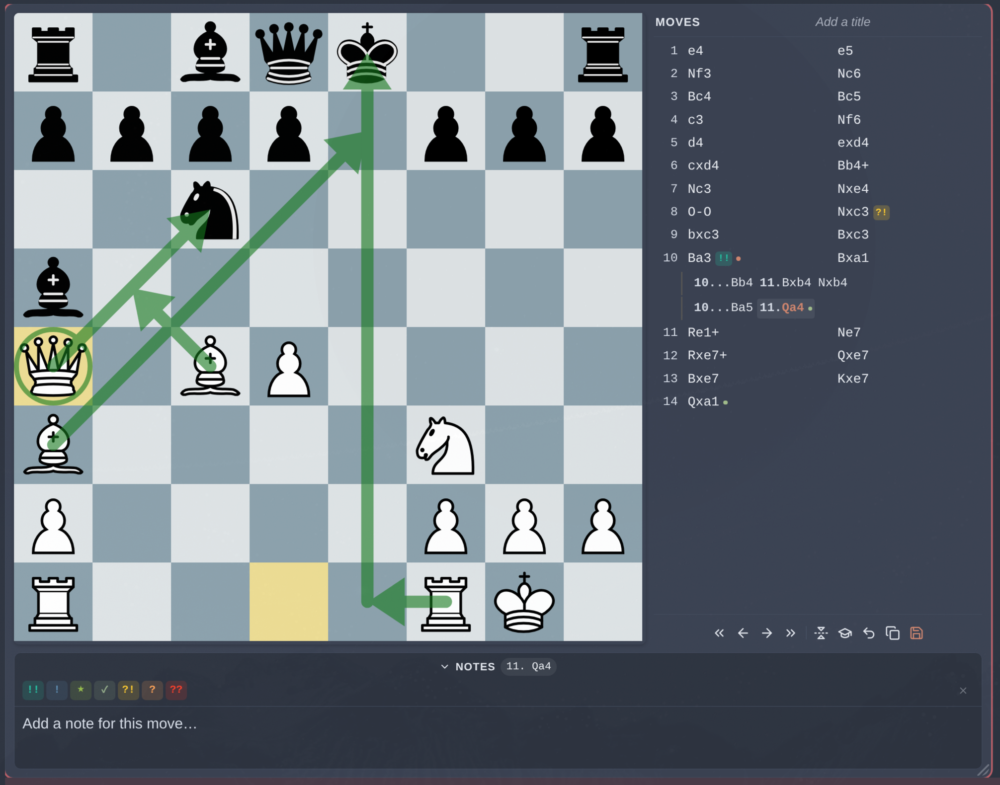
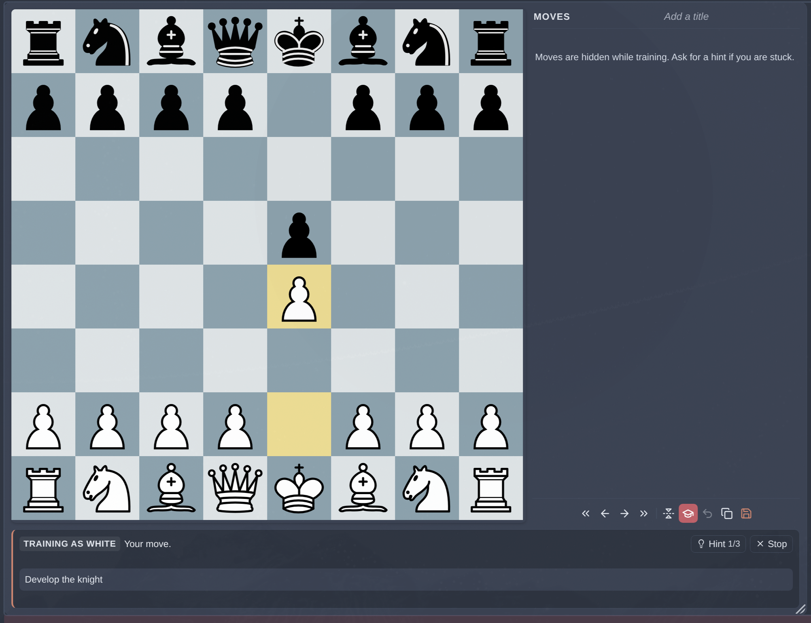
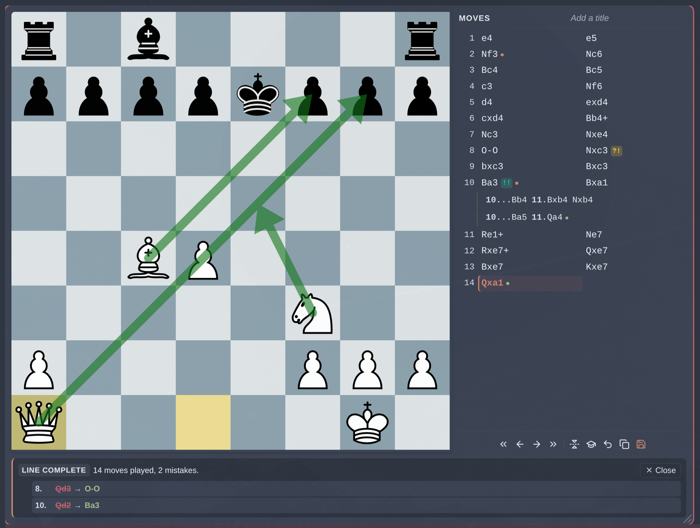
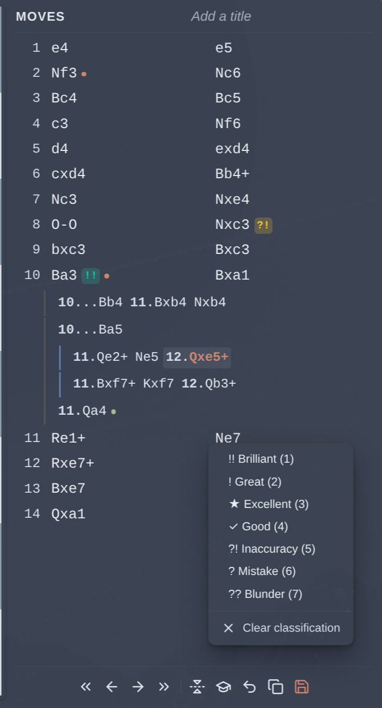
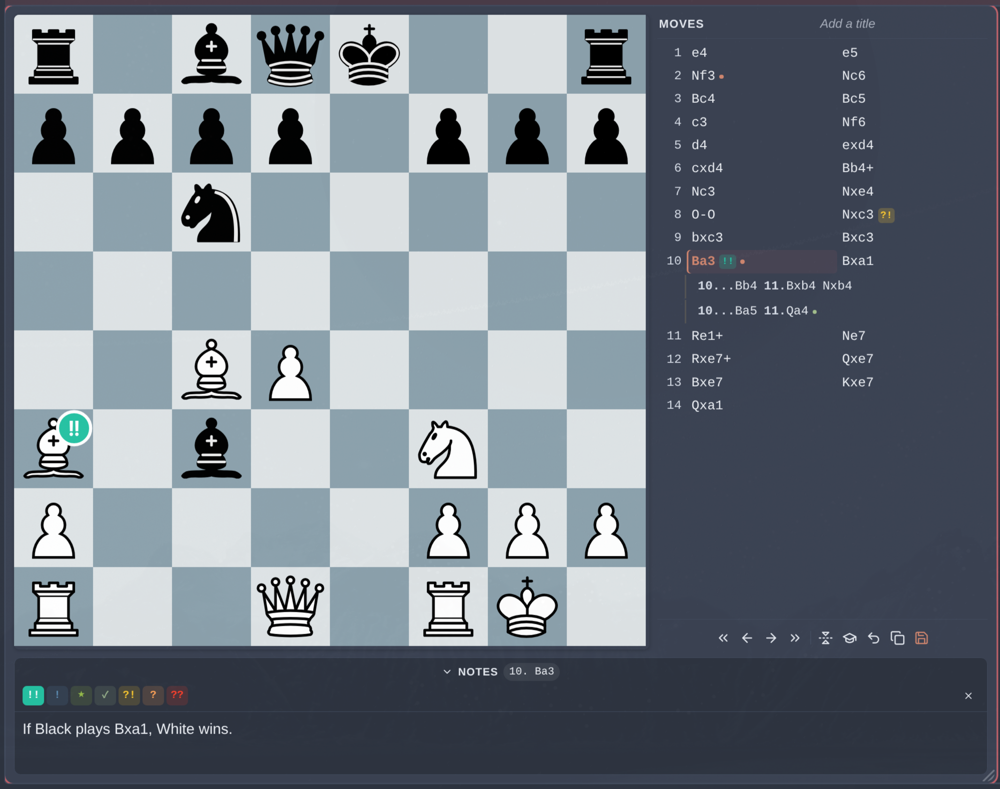
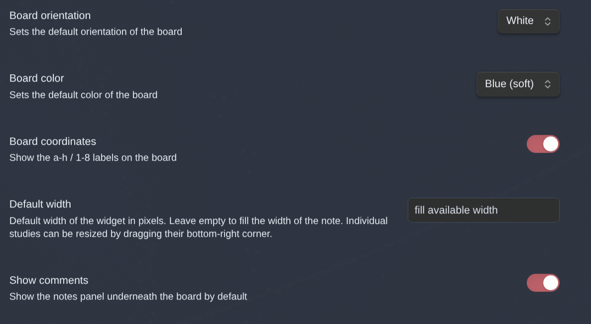

<!-- omit in toc -->
# Chess Study v2

> A chess study helper, PGN viewer/editor and opening trainer for [Obsidian](https://obsidian.md/).

**Chess Study v2** is a fork of [Obsidian Chess Study](https://community.obsidian.md/plugins/chess-study) by [@chrislicodes](https://github.com/chrislicodes). The original turns a PGN into a playable, annotatable board inside a note, with comments and arrows stored in your vault. This fork keeps all of that and adds the parts that turn a set of notes into something you can actually rehearse: variations of any depth, chess.com-style move classifications, a rebuilt widget, and a **trainer** that plays your study back at you and tells you where you went wrong.

<!-- SCREENSHOT: the hero shot. A study open in a note, board on the left with a
     couple of arrows drawn, move list on the right showing a mainline plus one
     or two nested variations, notes panel open underneath with some text in it.
     Full widget width, light or dark theme - whichever your vault uses. -->


<!-- omit in toc -->
## Table of contents

- [What v2 adds](#what-v2-adds)
	- [Trainer](#trainer)
	- [Variations at any depth](#variations-at-any-depth)
	- [Move classifications](#move-classifications)
	- [A rebuilt widget](#a-rebuilt-widget)
	- [Annotations you can see from the move list](#annotations-you-can-see-from-the-move-list)
	- [Autosave](#autosave)
- [Inherited from the original](#inherited-from-the-original)
- [Installation](#installation)
- [Usage](#usage)
- [Settings](#settings)
- [Keyboard shortcuts](#keyboard-shortcuts)
- [Known limitations](#known-limitations)
- [Development](#development)
- [Roadmap](#roadmap)
- [Credits](#credits)
- [Alternatives](#alternatives)
- [License](#license)

## What v2 adds

### Trainer

The graduation-cap button in the control strip starts a drill. It asks which colour you want to play, flips the board to it, and rewinds to the study's first position — the standard array for an ordinary game, or whatever FEN the study opens from.

From there you play your colour and the study plays the other. A move the study does not know is refused: the board snaps back, the attempted move is drawn as a red arrow, and it goes on the tally. Only the line counts — variations are alternatives to the move being asked for, not answers alongside it, so playing into one is a mistake like any other.

<!-- SCREENSHOT: a session in progress. Board with a hint arrow or a marked
     piece on it, the move list showing "Moves are hidden while training", and
     the trainer strip underneath with the Hint counter part-used (say 2/3) and
     an error tally showing. -->


Hints escalate, one per press, and a stage with nothing to offer is skipped so the first press always reveals something:

1. **What your study already says** — the note on the move being asked for, falling back to the note on the move just played.
2. **The piece to move**, marked on the board.
3. **An arrow** to where it goes.

Hints are drawn as board decorations that are never saved, and they reset as soon as the position moves on. The move list empties for the length of a session and the notes panel gives way to the trainer's own strip, since either one would hand over the answer.

When the line runs out, the drill ends and leaves a report: moves played, mistakes made, and a row per mistake giving the move number, what you played, and what the study wanted. The same wrong move in the same position counts once, with a multiplier.

<!-- SCREENSHOT: the end-of-session report. Ideally with three or four mistakes
     listed so the struck-through move / arrow / correct move layout is clear,
     and at least one showing a x2 multiplier. -->


Nothing a session does is written to your study — correct moves navigate, refused ones put the board back — so a drill can never leave stray variations behind.

### Variations at any depth

The original supported one level of variations. This fork makes the move tree recursive, so variations nest up to four levels deep, each with its own rail colour and indent.

Right-clicking any variation move opens a menu to **promote** it (one level, or straight to the mainline), **reorder** it among its siblings, or **delete** it — the last behind a confirmation naming how many moves will go, nested ones included.

<!-- SCREENSHOT: the move list only (crop it), showing a mainline with a
     variation two or three levels deep so the coloured rails and the stepped
     indents are visible, and the right-click menu open over one of the
     variation moves. -->


Playing a move that an existing variation already starts with follows that variation rather than creating a second one saying the same thing, and stepping back off the front of a variation lands on the move it hangs off.

### Move classifications

Seven chess.com-style labels — Brilliant, Great, Excellent, Good, Inaccuracy, Mistake, Blunder — set by pressing `1`–`7` (`0` clears), from a picker in the notes panel, or from the right-click menu on any move. Each shows as a coloured badge beside the move in the list and on the destination square of the board.

<!-- SCREENSHOT: a position where the current move carries a classification, so
     the badge on the board square and the matching badge in the move list are
     both visible. The notes panel open with the classification picker row
     showing would make it clearer still. -->


### A rebuilt widget

- **Fills the note width** instead of a fixed 750px box, and stacks the board above the move list on narrow screens.
- **Resizable** by dragging the bottom-right corner. The width is written back into the code block, so a study keeps its size.
- **Four board themes** — Blue (default), Blue soft, Green, Brown — drawn from two colours each rather than a bitmap per theme, with square highlights that follow the theme.
- **Coordinates drawn inside the board**, chess.com style. The original positioned them outside it, where the widget clipped them.
- **Flip the board**, and **copy the current FEN** to the clipboard.
- A **notes panel** that is labelled, collapsible, and shows which move a note belongs to.

### Annotations you can see from the move list

Moves carrying a note get an accent dot, moves carrying arrows get a green dot, and hovering either shows the note or counts the arrows. Previously the only way to find your annotations was to step through every move.

### Autosave

Changes are saved automatically, debounced, and flushed when the note closes. The save button keeps working and gains a dot while there is something unsaved. In the original, nothing autosaved — annotating a run of moves and closing the note lost all of it silently.

## Inherited from the original

Everything the original does still works:

- Import a PGN, start from a FEN, or begin a fresh game
- Studies stored as JSON in your vault
- Legal moves only
- Navigate with buttons or by clicking a move
- Draw and persist arrows and circles
- Notes per move, with Markdown support
- Undo the last move

## Installation

Chess Study v2 is **not in the community plugin store** — see [what is left to publish it](#roadmap). Install it by hand:

1. Download `main.js`, `styles.css` and `manifest.json` from the [latest release](../../releases/latest).
2. Create a folder named `chess-study-v2` in `<vault>/.obsidian/plugins/`.
3. Drop the three files into it.
4. Reload Obsidian and enable **Chess Study v2** under Settings → Community plugins.

> **Upgrading from the original Chess Study?** Your studies live in
> `<vault>/.obsidian/plugins/chess-study/storage/`. Copy that `storage` folder
> into the new plugin folder before enabling v2, or the existing `chessStudy`
> code blocks in your notes will not find their files.

## Usage

Put your cursor where you want the board and run the command **Chess Study: Insert FEN/PGN-Editor at cursor position**.

A modal opens where you can paste a PGN, paste a FEN, or leave it empty for a fresh game:


On submit, the study is written to `.obsidian/plugins/<plugin-id>/storage/{id}.json` and a code block is inserted at the cursor:


The block renders as the widget, styled to follow your theme and accent colour.

## Settings

Every setting has a default in Settings → Community plugins → Chess Study v2, and can be overridden per study by adding a line to the code block:

````markdown
```chessStudy
chessStudyId: V1StGXR8_Z5jdHi6B-myT
boardColor: green
boardOrientation: black
showCoordinates: false
```
````

| Setting            | Values                                        | Description                                                   |
| ------------------ | --------------------------------------------- | ------------------------------------------------------------- |
| `chessStudyId`     | valid nanoid                                  | Which stored study to render. Inserted by the command.        |
| `boardOrientation` | `white` \| `black`                            | Which way round the board starts                              |
| `boardColor`       | `blue` \| `blue-soft` \| `green` \| `brown`   | Board theme                                                   |
| `showCoordinates`  | `true` \| `false`                             | Show the a–h / 1–8 labels                                     |
| `boardSize`        | number of pixels                              | Widget width. Written automatically when you drag to resize.  |
| `viewComments`     | `true` \| `false`                             | Whether the notes panel starts open                           |

<!-- SCREENSHOT: the plugin's settings tab, so the defaults are visible at a
     glance. Settings -> Community plugins -> Chess Study v2. -->


## Keyboard shortcuts

Click a study first — the shortcuts act on the one you last clicked, and a thin accent ring shows which that is.

| Key       | Action                     |
| --------- | -------------------------- |
| `←` / `→` | Previous / next move       |
| `↑` / `↓` | First / last move          |
| `1`–`7`   | Classify the current move  |
| `0`       | Clear the classification   |

## Known limitations

- **Shortcuts only work in Reading view.** In Live Preview the widget is rendered inside CodeMirror, which takes the keys first — more so with Vim mode enabled. The buttons and mouse work everywhere.
- **Desktop only.** The widget has not been adapted for touch.
- **Underpromotion is not supported** — pawns reaching the last rank always promote to a queen.
- **No PGN export yet.** Studies live as JSON; classifications already record their NAG codes for a future exporter.

## Development

```bash
npm install
npm run dev      # esbuild in watch mode
npm run build    # typecheck + production bundle
npm test         # node:test suite for the move tree and trainer logic
npm run deploy   # build, then copy main.js/styles.css/manifest.json into a vault
```

`npm run deploy` targets the path in `deploy.mjs`; override it with the `CHESS_STUDY_VAULT_PLUGIN_DIR` environment variable. Reload the plugin in Obsidian afterwards to pick up the change.

## Roadmap

Before this can be submitted as a community plugin:

- [x] Give the plugin its own `id`, `name` and `author` in `manifest.json`
- [x] Align `manifest.json`, `package.json` and `versions.json` on 2.0.0
- [ ] Replace the inherited screenshots with v2 ones
- [ ] Tag `2.0.0` and publish the draft release the workflow builds
- [ ] Submit to [obsidian-releases](https://github.com/obsidianmd/obsidian-releases), explaining what the fork adds over the original

Beyond that:

- [ ] Get the shortcuts working in Live Preview
- [ ] PGN export, including classifications as NAGs
- [ ] A view to manage stored studies
- [ ] Spaced repetition across studies, built on the trainer
- [ ] Mobile support

## Credits

Chess Study v2 is a fork of [chrislicodes/obsidian-chess-study](https://github.com/chrislicodes/obsidian-chess-study), with thanks to [@chrislicodes](https://github.com/chrislicodes) for the original and to [@latenitecoding](https://github.com/latenitecoding) for the FEN support it inherited.

- Chess visuals are powered by [Chessground](https://github.com/lichess-org/chessground)
- Chess logic is powered by [Chess.js](https://github.com/jhlywa/chess.js)
- The notes editor is powered by [TipTap](https://github.com/ueberdosis/tiptap)
- Icons are provided by [Lucide](https://github.com/lucide-icons/lucide)
- Everything is tied together by [React](https://github.com/facebook/react)

## Alternatives

If you want to look at FEN snapshots instead, these Obsidian plugins do that:

- [SilentVoid13/Chesser](https://github.com/SilentVoid13/Chesser)
- [pmorim/obsidian-chess](https://github.com/pmorim/obsidian-chess)
- [THeK3nger/obsidian-chessboard](https://github.com/THeK3nger/obsidian-chessboard)

## License

Chess Study v2 is licensed under GPL-3.0-or-later, the same licence as the original. See [LICENSE](LICENSE).
